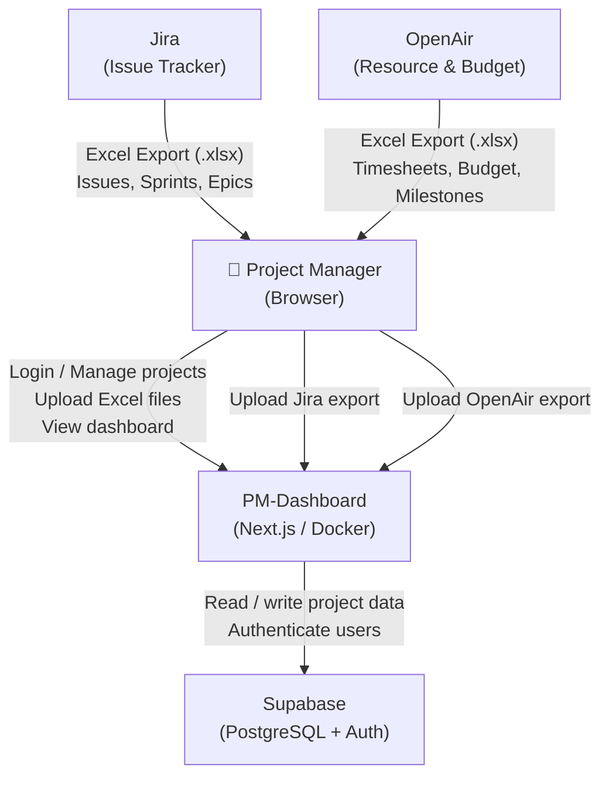
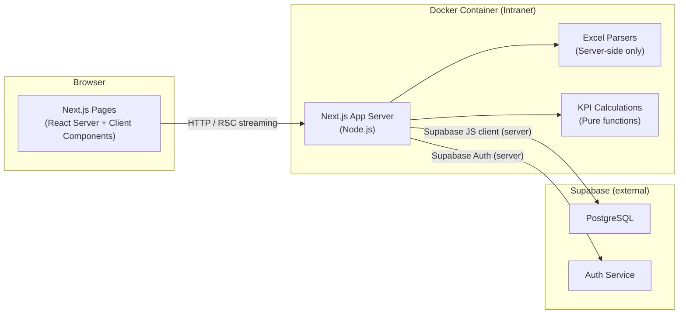

# Chapter 3: Context and Scope

## Business Context

The PM-Dashboard sits at the intersection of three external systems. It consumes data from Jira and OpenAir via Excel file uploads and persists it in Supabase. Project managers interact with the system through a web browser.

## External Interfaces

### Jira (source system)

| Property | Detail |
|---|---|
| Integration type | Manual file upload (no API) |
| File format | `.xlsx` / `.xls` |
| Initiated by | Project manager downloads export from Jira, then uploads via dashboard UI |
| Key data | Issue Key, Summary, Issue Type, Status, Story Points, Sprint, Epic, Assignee, Created, Resolved |
| Column names | English and German column headers are both supported |
| Maximum file size | 10 MB |

### OpenAir (source system)

| Property | Detail |
|---|---|
| Integration type | Manual file upload (no API) |
| File format | `.xlsx` / `.xls` |
| Initiated by | Project manager downloads export from OpenAir, then uploads via dashboard UI |
| Key data | Employee, Role, Phase, Planned Hours, Actual Hours, Budget, Milestones |
| Column names | English and German column headers are both supported |
| Maximum file size | 10 MB |

### Supabase (persistence and auth)

| Property | Detail |
|---|---|
| Role | Managed PostgreSQL database + Supabase Auth |
| Access | Server-side only (via `@supabase/ssr`); the anon key is never used for write operations |
| Security | Row Level Security enforces that each user can only access their own projects |
| Hosted | Supabase Cloud (MVP) or Supabase Self-Hosted (future intranet deployment) |

## Technical Context

The Next.js application server handles all communication with Supabase. The browser never connects to Supabase directly for data reads or writes — only the server-side Supabase client is used for mutations. Client components that trigger actions do so via Next.js Server Actions.
