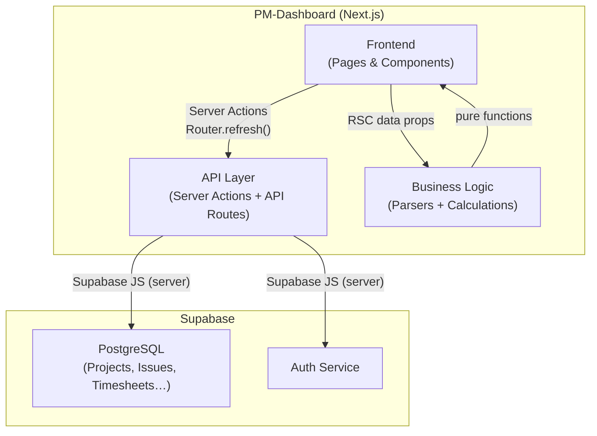

# Chapter 5: Building Block View

## Level 1 — System Decomposition



| Block | Responsibility |
|---|---|
| **Frontend** | Renders pages and components; handles file upload UI, forms, and chart rendering |
| **API Layer** | Authenticates requests, validates input, orchestrates imports, writes to database |
| **Business Logic** | Excel parsing, KPI calculation, stability index — all pure and stateless |
| **Supabase** | Persistent storage with RLS, user session management |

---

## Level 2 — Frontend

```
/app
  /(auth)/login/page.tsx          Login form (client component)
  /(dashboard)/layout.tsx         Auth guard + navigation shell
  /(dashboard)/page.tsx           Project overview (Server Component)
  /(dashboard)/projects/[id]/
    page.tsx                      Project dashboard (Server Component)
    import/page.tsx               Import UI (client components)
    settings/page.tsx             Threshold configuration (Server Component)
    time/page.tsx                 Time Analysis page (Server Component)

/components
  /ui                             shadcn/ui base components (do not edit)
  /dashboard
    project-card.tsx              Project card: stability badge + last import date
    create-project-dialog.tsx     Dialog + form for new projects
    budget-card.tsx               Budget KPI card with progress bar
    schedule-card.tsx             Schedule KPI card with milestone list
    resource-card.tsx             Resource utilisation bar chart (Recharts)
    scope-card.tsx                Scope KPI card with velocity mini-chart
    time-analysis-card.tsx        Time Analysis tile: last OA import date + current-month hours; links to /time
    thresholds-form.tsx           Threshold settings form with reset dialog
    time-by-team-chart.tsx        Horizontal bar chart: hours per team (Recharts)
    time-by-category-chart.tsx    Horizontal bar chart: hours per task category (Recharts)
  /import
    upload-zone.tsx               Drag-and-drop file upload zone
    import-log-list.tsx           Recent import history list
  /shared
    stability-badge.tsx           Traffic-light badge (green/yellow/red/none)
    login-form.tsx                Login form (uses auth Server Action)
```

---

## Level 2 — API Layer

```
/lib/actions
  auth.actions.ts                 login(), logout() Server Actions
  project.actions.ts              createProject() Server Action
  threshold.actions.ts            updateThresholds(), resetThresholds()

/app/api/projects/[id]/import/
  route.ts                        POST: file upload, parse, batch-insert
```

**Import API Route — internal flow:**
1. Authenticate user (Supabase session)
2. Verify project ownership
3. Check file size (max 10 MB) and MIME type
4. Forward buffer to parser (`jiraParser` or `openAirParser`)
5. Delete existing rows for this project (full replace, no append)
6. Batch-insert parsed records (max 2000 rows per insert)
7. Write `import_log` entry
8. Return `{ success, recordsImported, errors, warnings }`

---

## Level 2 — Business Logic

```
/lib/parsers
  jira-parser.ts                  Buffer → JiraParseResult
  openair-parser.ts               Buffer → OpenAirParseResult

/lib/calculations
  kpi-calculations.ts             calcBudgetKPIs, calcScheduleKPIs,
                                  calcResourceKPIs, calcScopeKPIs
  stability-index.ts              calcStabilityIndex → StabilityResult
  time-calculations.ts            calcHoursByTeam, calcHoursByCategory,
                                  calcEpicHours, calcBugCost

/lib/supabase
  paginate.ts                     fetchAllTimesheets, fetchAllTimesheetsForProjects
                                  — paginated fetch that bypasses Supabase max_rows cap

/lib/validations
  auth.schema.ts                  Zod schema for login
  project.schema.ts               Zod schema for project creation
  thresholds.schema.ts            Zod schema for threshold update

/lib/errors.ts                    Central error message constants
/types/domain.types.ts            All business domain TypeScript types
/types/database.types.ts          Supabase-generated DB row types
```

**Parser design:**  
Both parsers accept a `Buffer`, use SheetJS to read the workbook, map column headers case-insensitively to domain fields, skip empty rows, and collect parse errors by row number. Unknown columns are silently ignored.

The OpenAir parser supports two export formats:
- **Old format**: `Mitarbeiter / Rolle / Phase / Geplante Stunden / Gebuchte Stunden / Datum` — multi-block sheets with separate timesheet, budget, and milestone sections
- **New format**: `Date / Client / Project / Task / Hours / Notes / Status` — single-block timesheet-only export

New-format detection (`colProject !== -1`) controls:
- Team extraction: regex `/[-–]\s*(Team\s+.+)$/i` on `Project` → stores `"Team Panda"` (includes prefix)
- Ticket ref extraction: regex `/\b([A-Z]+-\d+)\b/` on `Notes`
- Task category: `startsWith` match against `[Regular Meeting, Development, Steuerung, Organization]`; stores canonical name
- Status filter: only `submitted`/`approved` rows are stored; others are counted as skipped
- Budget warning suppressed when no budget sheet is present (new-format exports are timesheet-only)

**Calculation design:**  
All KPI functions are pure — they accept domain arrays and return a typed result object. `calcStabilityIndex` composes the four KPI results and a `ProjectThresholds` object into a single `StabilityResult` with per-dimension status and an overall score (0–100).

`time-calculations.ts` contains four additional pure functions for the Time Analysis page: hours grouped by team, by category, by Jira ticket reference, and bug cost (hours on Bug-type issues relative to story points). `calcEpicHours` returns `EpicHoursEntry` objects which include `issueType` and `summaryPreview` (first 25 characters of the Jira summary, truncated with `…`) alongside hours and story points.

---

## Level 2 — Supabase Schema

| Table | Content |
|---|---|
| `projects` | Project master data; `owner_id` links to `auth.users` |
| `import_logs` | One row per import attempt |
| `jira_issues` | Parsed Jira issues; replaced on every Jira import |
| `jira_sprints` | Parsed Jira sprints; replaced on every Jira import |
| `oa_timesheets` | Parsed OpenAir timesheet rows |
| `oa_milestones` | Parsed OpenAir milestones |
| `oa_budget_entries` | Parsed OpenAir budget rows |
| `project_thresholds` | One row per project; created with defaults on project creation |
