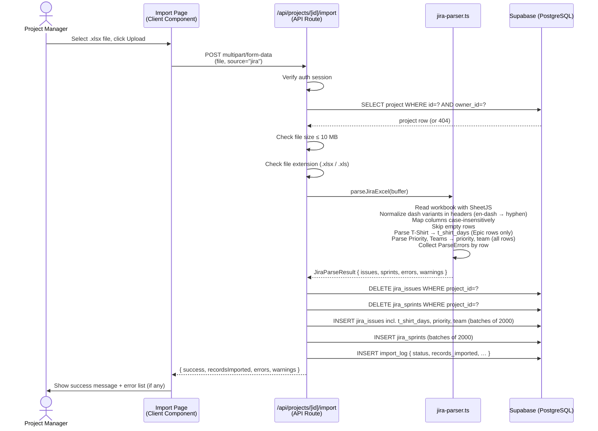
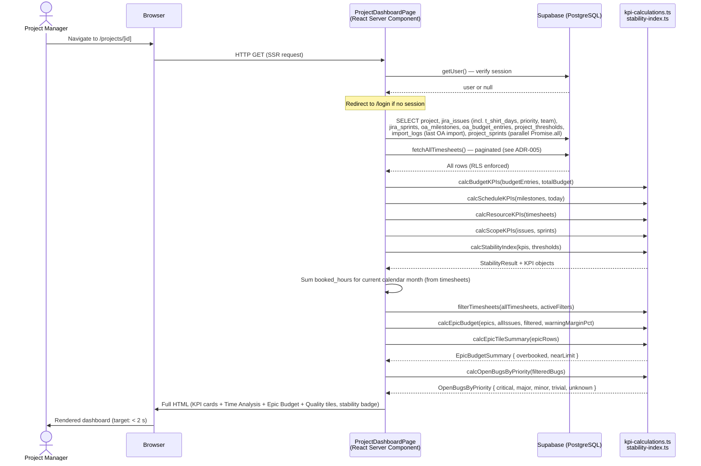
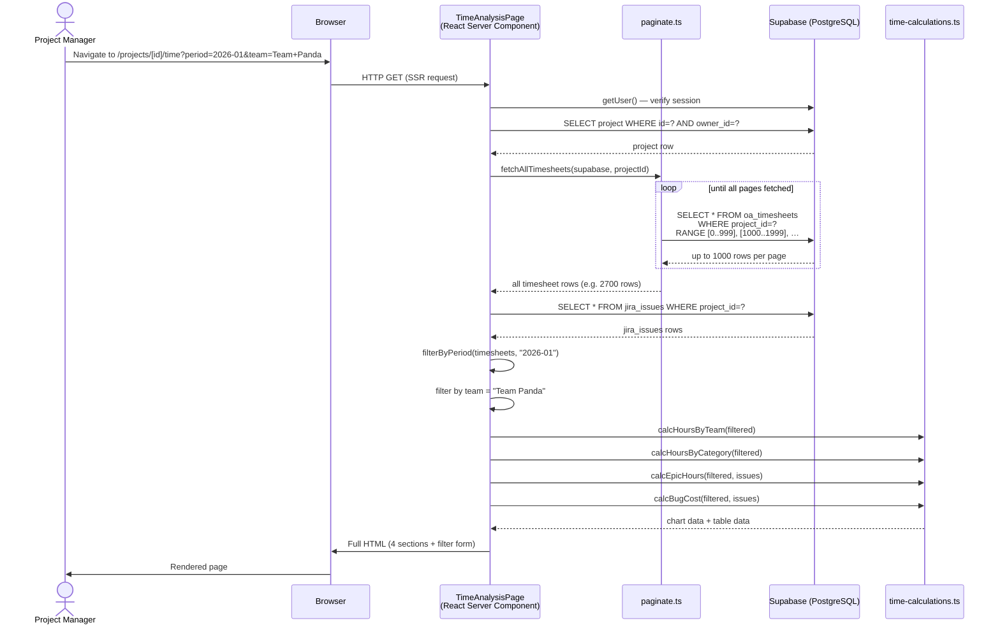
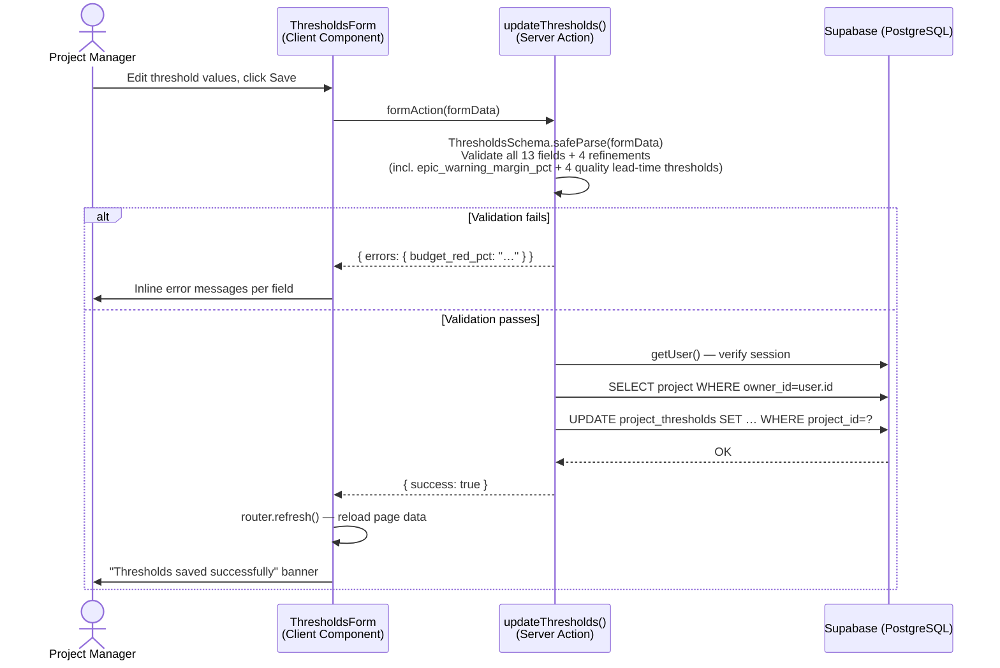
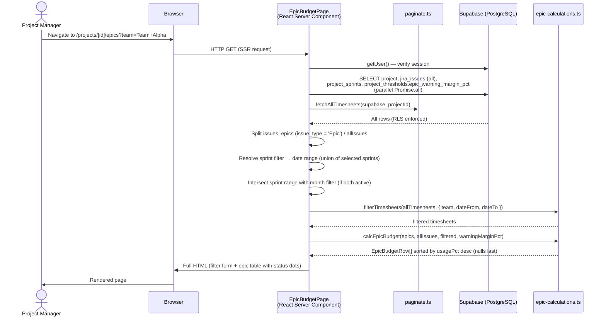
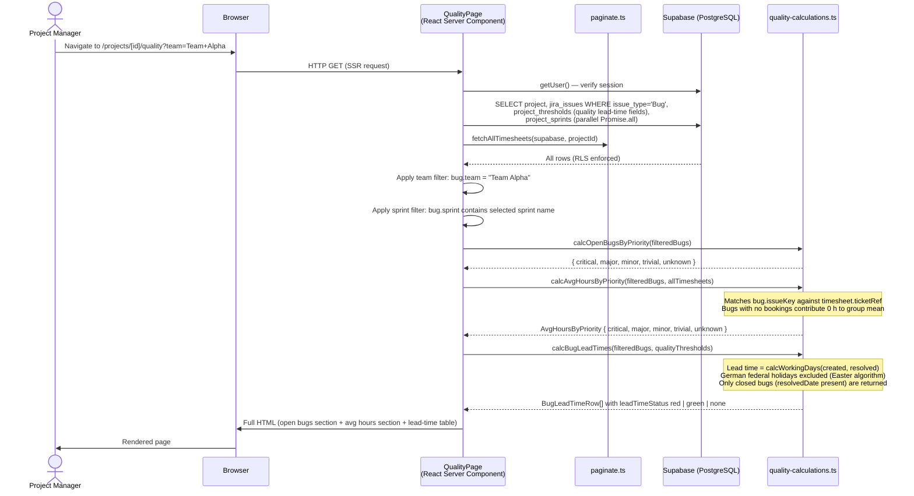

# Chapter 6: Runtime View

## Scenario 1 — Excel Import Flow

A project manager uploads a Jira Excel export. The sequence shows the full server-side processing path.

**Key invariants:**
- The delete-then-insert pattern guarantees that re-importing the same file produces the same result (idempotent for the dataset)
- If the parser returns hard errors (missing Issue Key), the import still proceeds for valid rows; errors are surfaced in the response, not as an HTTP 4xx
- A hard database error on insert causes the API to return `success: false` and writes a `status: 'error'` import log entry

---

## Scenario 2 — Dashboard Page Load

A project manager navigates to a project dashboard. All data fetching and computation happens server-side.

**Key invariants:**
- All nine database queries (including `project_sprints` for sprint-filter resolution and `import_logs` for the Time Analysis tile) run in a single `Promise.all` — no sequential round-trips
- KPI computation is synchronous and happens in the same server request; no separate API call is needed
- RLS ensures that even if the wrong `[id]` is requested, Supabase returns empty results rather than another user's data
- The Time Analysis tile is always rendered; it shows `—` when no OpenAir import exists and `0 h` when imported but no bookings fall in the current month
- If no KPI data exists, the dashboard renders an empty-state prompt instead of the four KPI cards, but the Time Analysis tile remains visible

---

## Scenario 3 — Time Analysis Page Load

A project manager navigates to the Time Analysis page and applies a team filter. All data fetching and computation happens server-side; the filter is a plain HTML GET form (no client-side requests).

**Key invariants:**
- `fetchAllTimesheets` paginates automatically (1000 rows/page) to bypass Supabase's `max_rows` server cap — results are identical regardless of the row insertion order in the database (see ADR-005)
- The filter form uses GET parameters — the URL is bookmarkable and the page works without JavaScript
- Period filter supports both `YYYY-MM` (calendar month) and `7d` (rolling 7 days)
- All four calculation functions receive only the already-filtered subset; no data from other periods or teams reaches the chart layer

---

## Scenario 4 — Threshold Update

A project manager saves new threshold values on the settings page.

---

## Scenario 5 — Epic Budget Page Load

A project manager navigates to the Epic Budget detail page with an optional team/sprint/month filter. All data fetching and computation happens server-side.

**Key invariants:**
- A single `Promise.all` loads all DB data; `fetchAllTimesheets` runs in parallel via pagination
- `filterTimesheets` is a pure function — filtering happens in the calculation layer, not in the DB query
- Sprint filter uses the union of selected sprint date ranges (min start → max end); when combined with a month filter, the intersection is computed before passing `dateFrom`/`dateTo`
- Rows with `t_shirt_days = null` receive `status = 'unknown'` and are sorted to the bottom of the table
- The page works without JavaScript (GET form for filters, bookmarkable URLs)

---

## Scenario 6 — Quality Page Load

A project manager navigates to the Quality detail page with an optional team/sprint filter to analyse bug lead times.

**Key invariants:**
- Bugs are filtered in the application layer (not in the DB query) using `jira_issues.team` and `jira_issues.sprint` — consistent with the filter pattern used on the Epic Budget page
- Lead time is measured in German working days (Mon–Fri), excluding all 9 German federal holidays; the Easter date is computed analytically via the Anonymous Gregorian algorithm for any year
- A bug exactly at its threshold is green (`leadTimeDays > threshold` → red, `≤` → green)
- Bugs with no `priority` receive `leadTimeStatus = "none"` and no threshold is applied
- Bugs with no `resolved_date` are excluded from the lead-time table but counted in the open-bugs section
- The team filter uses `jira_issues.team` (Jira "Teams" custom column), not the OpenAir team field — the two are independent
- The page works without JavaScript (GET form for filters, bookmarkable URLs)
