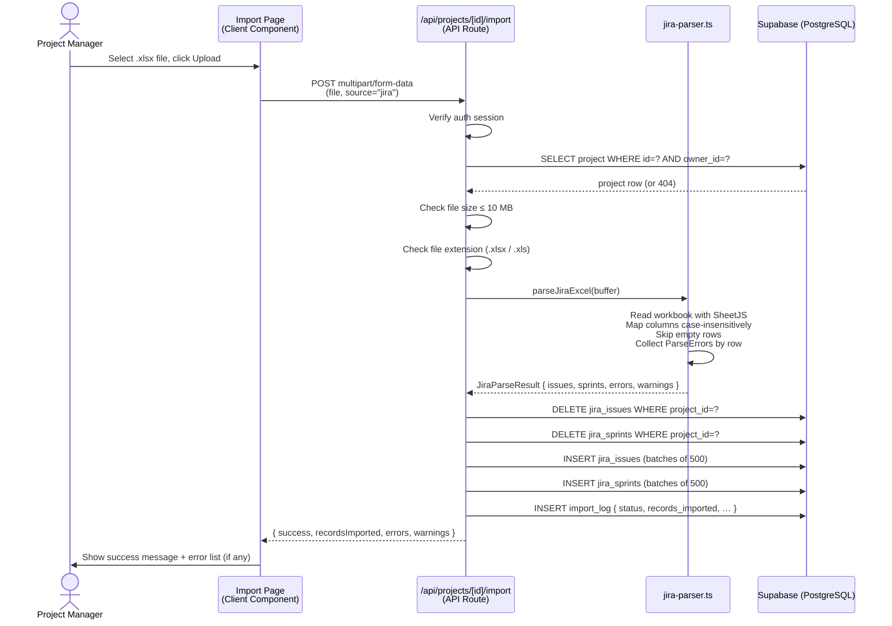
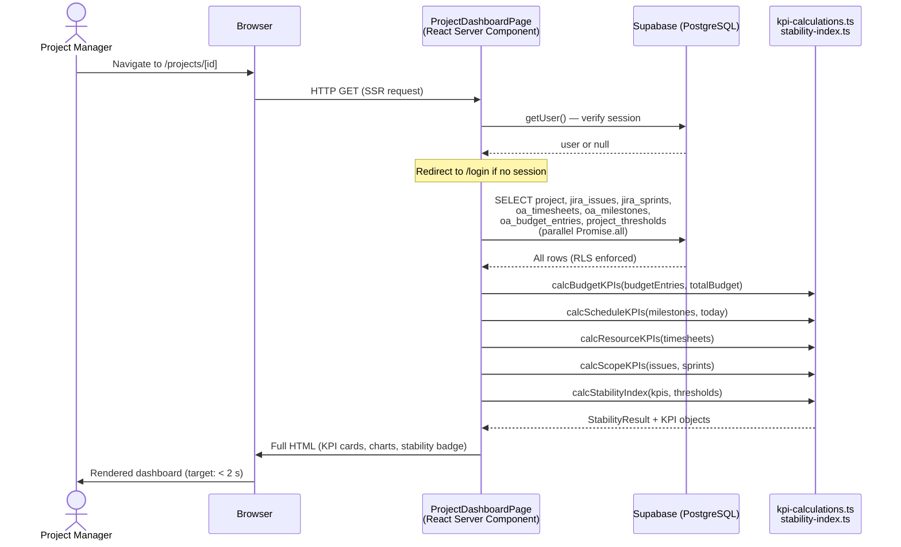
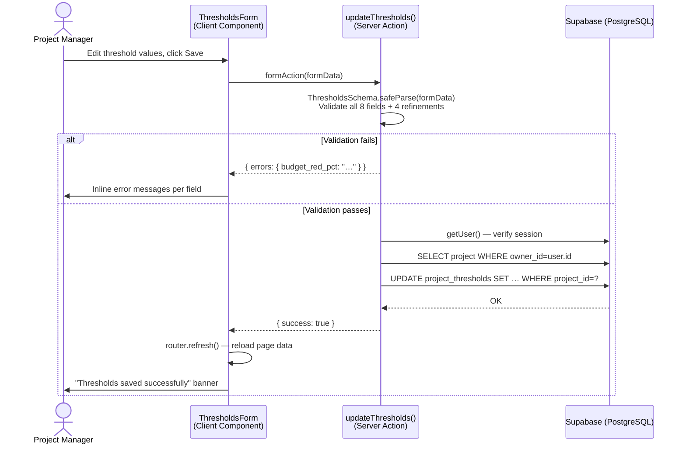

# Chapter 6: Runtime View

## Scenario 1 — Excel Import Flow

A project manager uploads a Jira Excel export. The sequence shows the full server-side processing path.

**Key invariants:**
- The delete-then-insert pattern guarantees that re-importing the same file produces the same result (idempotent for the dataset)
- If the parser returns hard errors (missing Issue Key), the import still proceeds for valid rows; errors are surfaced in the response, not as an HTTP 4xx
- A hard database error on insert causes the API to return `success: false` and writes a `status: 'error'` import log entry

---

## Scenario 2 — Dashboard Page Load

A project manager navigates to a project dashboard. All data fetching and computation happens server-side.

**Key invariants:**
- All seven database queries run in a single `Promise.all` — no sequential round-trips
- KPI computation is synchronous and happens in the same server request; no separate API call is needed
- RLS ensures that even if the wrong `[id]` is requested, Supabase returns empty results rather than another user's data
- If no import data exists, the dashboard renders an empty-state prompt instead of KPI cards

---

## Scenario 3 — Threshold Update

A project manager saves new threshold values on the settings page.

